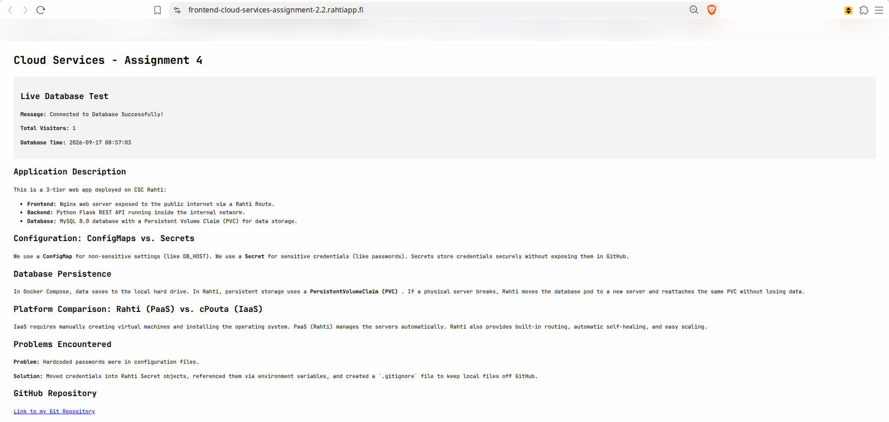

# Assignment 4 - Containerized 3-Tier Application on CSC Rahti

## Application Description
This application is a 3-tier web app deployed on CSC Rahti (OpenShift/Kubernetes):
- **Frontend**: Nginx web server exposed to the public internet via a Rahti Route.
- **Backend**: Python Flask REST API running inside the internal cluster network.
- **Database**: MySQL 8.0 database with a Persistent Volume Claim (PVC) for data storage.

**Live URL**: http://frontend-cloud-services-assignment-2.2.rahtiapp.fi

---

## Configuration: ConfigMaps vs. Secrets
- **ConfigMap (`app-config`)**: Used for non-sensitive settings like `DB_HOST`, `DB_PORT`, `DB_NAME`, and `DB_USER`.
- **Secret (`generic-mysql-secret`)**: Used for sensitive credentials like `MYSQL_ROOT_PASSWORD` and `DB_PASSWORD`.
- **Why they are different**: Secrets store credentials securely in Rahti without exposing passwords in GitHub repositories or container images.

---

## Database Persistence
- **Rahti PVC vs. Local Docker Volume**: In Docker Compose, data is saved on a folder on your local computer's hard drive. In Rahti, persistent storage uses a **PersistentVolumeClaim (PVC)** connected to network storage. If a physical server in the cloud breaks, Rahti moves the database pod to a new server and reattaches the same PVC without losing data.

---

## Orchestration Experiments

### 1. Pod Recovery (Self-Healing)
- **Action**: Manually deleted the backend pod using `oc delete pod <backend-pod-name>`.
- **Result**: Rahti noticed the missing pod and automatically launched a new one.
- **Explanation**: The **Deployment** and **ReplicaSet** resources are responsible for this behavior because they constantly monitor the cluster to ensure the desired number of pods (`replicas: 1`) is always running.

### 2. Scaling
- **Action**: Scaled the backend deployment to 3 replicas using `oc scale deployment/backend --replicas=3`.
- **Result**: 3 separate backend pods ran simultaneously.
- **Explanation**: The frontend communicates with the backend via the **Backend Service name** (`http://backend:8000`) through internal Kubernetes DNS. The Service acts as an internal load-balancer, routing traffic to all healthy pods without needing individual pod IP addresses.

### 3. Database Persistence
- **Action**: Deleted the MySQL database pod using `oc delete pod <database-pod-name>`.
- **Result**: A new database pod started, reconnected to `mysql-pvc`, and served the existing data without data loss.

### 4. Application Update
- **Action**: Updated the backend code to version `1.0.1`, pushed the new image to Docker Hub, updated `rahti/backend-deployment.yaml`, and applied the changes using `oc apply`.
- **Result**: Rahti performed a **Rolling Update** by creating the new container while terminating the old container, ensuring zero downtime for end users.

**Update Initiated (`ContainerCreating`)**:

**Update Completed (`Terminating` / `Completed`)**:

**Web App V2.0 Verification**:

**Live WebSite**:

---

## Problems Encountered and Solutions
- **Problem**: Hardcoded passwords were found in configuration files.
- **Solution**: Removed hardcoded strings, moved credentials into Rahti Secret objects, referenced them via environment variables, and created a `.gitignore` file to keep local `.env` files off GitHub.

---

## Platform Comparison: Rahti (PaaS) vs. cPouta + Docker Compose (IaaS)
- **Deployment**: IaaS required manually creating virtual machines, installing Docker, and configuring the operating system. PaaS (Rahti) manages the servers automatically so we only deploy container manifests.
- **Networking**: IaaS required manual port mapping and VM firewall security rules. PaaS provides built-in internal service DNS and TLS-encrypted public Routes.
- **Management**: IaaS requires manual intervention if a virtual machine or container crashes. PaaS provides automatic self-healing, load-balanced scaling, and rolling updates out-of-the-box.